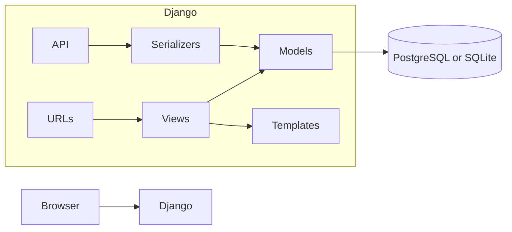

# Technical architecture — Campus Library

## Overview

The project is a single Django project package `config` and one domain app `catalog` that owns models, HTML views, templates, URL routes, signals, tests, and DRF viewsets. Static assets live under `static/`; collected output goes to `staticfiles/` for WhiteNoise.

## Models and relationships

| Model | Role |
|-------|------|
| `Author` | Person who wrote one or more books. |
| `Book` | Title, optional ISBN/year, M2M to `Author`. |
| `BookCopy` | Physical item identified by unique `copy_code`; FK to `Book`. |
| `MemberProfile` | `OneToOne` to `User`; phone; `max_active_loans` (default 5). |
| `Loan` | Links `BookCopy` and `MemberProfile`; `checked_out_at`, optional `due_at` (default +14 days in `save()` if omitted), `returned_at` when returned. |

**Delete policy:** `Loan.book_copy` uses `on_delete=models.PROTECT` so copies with loan history cannot be deleted until loans are handled appropriately. `Book` → `BookCopy` is `CASCADE` (deleting a book removes its copies if the database allows; active `PROTECT` loans on those copies will block deletion).

**Concurrency / integrity:** A partial unique constraint (`unique_active_loan_per_copy`) ensures at most one row per copy with `returned_at IS NULL`. `Loan.clean()` mirrors business rules for clearer validation errors before save.

## Request flow (examples)

- **Book list** (`BookListView`): queryset uses `with_inventory()` to annotate total, on-loan, and available copy counts; `prefetch_related("authors")` avoids N+1 in the template. Optional `q` and `available_only` filter the queryset.
- **Checkout** (`LoanCheckoutView`): `LoanCheckoutForm` limits `book_copy` to copies not appearing in an active loan; staff choose `member`, members default to their own profile.
- **Return** (`LoanReturnView`): POST sets `returned_at`; JSON response when `X-Requested-With: XMLHttpRequest` for the loan list page script.

## Authentication and authorization

- **Signup** creates a `User`; a `post_save` signal ensures a `MemberProfile` exists; optional phone is saved from the signup form.
- **Staff** (`user.is_staff`): book/author/copy CRUD, Open Library lookup, seeing all loans, checking out for any member.
- **Members**: browse catalog, checkout/return their loans, see only their loans in list/API (unless staff).

`StaffRequiredMixin` combines `LoginRequiredMixin` and `UserPassesTestMixin` with `raise_exception=True` so non-staff users receive HTTP 403 on staff-only views.

## Settings layout

- `config.settings` package defaults to `base.py` (SQLite when `DATABASE_URL` unset, `DEBUG` from env, WhiteNoise, DRF defaults).
- `config.settings.production`: `DEBUG=False`, secure cookies, HTTPS redirect — use on a public host with TLS.

## External integration

**Open Library** (`OpenLibraryLookupView`): staff-only GET endpoint; the book form uses `fetch()` to request title (and optional author names) by ISBN. Timeouts and non-200 responses map to JSON errors instead of crashing the page.

## Testing strategy

- **Models:** duplicate active loan on same copy; `max_active_loans` enforcement via `full_clean()`.
- **Views:** anonymous book list 200; staff book create redirect and persisted row.
- **API:** unauthenticated loan list forbidden; authenticated member sees only own loans in paginated results.
